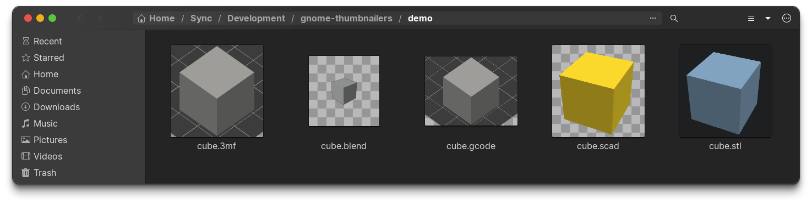

# gnome-thumbnailers

This is a small set of custom thumbnailer scripts (mostly for 3D printing formats) that I crafted based on various samples floating about on the Internet, and which work in GNOME 42+.

In short, these will render pretty little file previews in your file manager (not just Nautilus, but that is what I tested with):

## Supported Formats

* `.3mf` (Cura, PrusaSlicer, SuperSlicer, etc.)
* `.gcode` with embedded thumbnails
* `.scad` (OpenSCAD, will blindly render the default object)
* `.stl` (Actually uses OpenSCAD to render as well)
* `.blend` (uses the built-in `blender-thumbnailer` that comes with Blender)

## Installation

* put `.thumbnailer` files in `/usr/share/thumbnailers`
* put the other files in `/usr/local/bin`, marked as executable
* remove all the cached thumbnails in `~/.cache/thumbnails`
* restart Nautilus with `nautilus -q`

The `Makefile` does that for you.

## Dependencies

* `3mf.thumbnailer` and `gcode.thumbnailer` require nothing but Python 3 installed, because they cheat and use the thumbnail the slicer inserts into the file.
* `stlscad.thumbnailer` requires `Xvfb`, `openscad` and `ImageMagick` installed to render and convert files.
* `blender.thumbnailer` requires Blender to be installed.

## FAQ

> But isn't `openscad` prevented from accessing X because of `bwrap` thumbnail generation sandboxing in modern GNOME?

Yes. But it works _perfectly_ with `xvfb-run` and software rendering, so I'd rather take the performance hit rather than spend hours trying to persuade `bwrap` to do weird stuff like `--bind /tmp/.X11-unix/X0 /tmp/.X11-unix/X0 --setenv DISPLAY :0`. 

Sometimes brute force is the simplest, more maintainable (and more secure) approach.

> I have a `.3mf` or `.gcode` file without thumbnail, is the thumbnailer broken?

No. It's quite likely that the slicer you used to create it did not include a thumbnail, or that it is in a weird format. There are limits to these things.

> My OpenSCAD thumbnails are blank!

This usually happens when it's either a library file (that would render nothing on its own) or a customizer file that is missing some default (and hence renders nothing as well).

> My Blender thumbnails are blank!

That usually happens when you either don't have a camera defined or it's pointing towards literally nothing.
